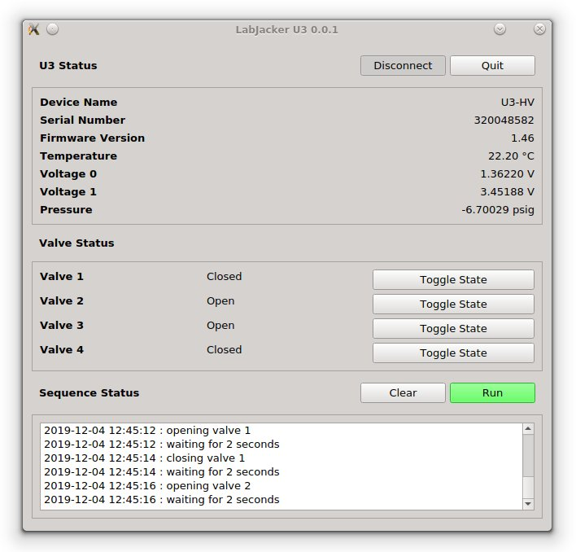

## LabJacker U3



LabJacker U3 is designed to control a custom piece of lab hardware, which is built around a [LabJack U3](https://labjack.com/products/u3) device.

### Requirements

The code is Python based (tested with various version of Python3), and has the following dependencies:

  * [PyQT5](https://www.riverbankcomputing.com/software/pyqt/intro)
  * [LabJack Python](https://github.com/labjack/LabJackPython)

The computer to which the LabJack device is connected will also require the appropriate drivers for the LabJack device:

  * [https://labjack.com/support/software/installers/ud](https://labjack.com/support/software/installers/ud)

### Running the program

If all requirements are available, the program can be run using the command:

```
python labjacker_u3.py
```

For testing purposes, the file `u3.py` defines a `U3` class which generates random values, and can be used in place of the LabJack Python `U3` class.
